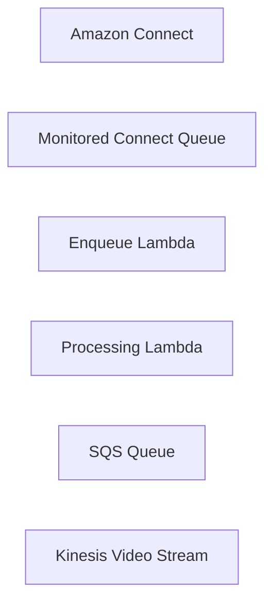

# Voicemail for Amazon Connect
This seems like a pretty major oversight, and AWS discontinued a codebase that did support this feature.
This is super duper alpha, not recommended, just a pet project.

## Components
- Amazon Connect
- SQS
- Lambda
- S3
- Kinesis Video Stream

## Architecture

## Problem space
Amazon Connect is a pretty powerful system.
But it's designed for interactive sessions, and not really built as a generalized phone system.

The call recording feature records only when an agent is talking with a caller- so it can be used for outbound calling and for when someone picks up a queue.
However, in order to record voicemail, we have to abuse the media streaming features of Amazon Connect.

## Required setup
The Connect "start media streaming" block must be enabled.